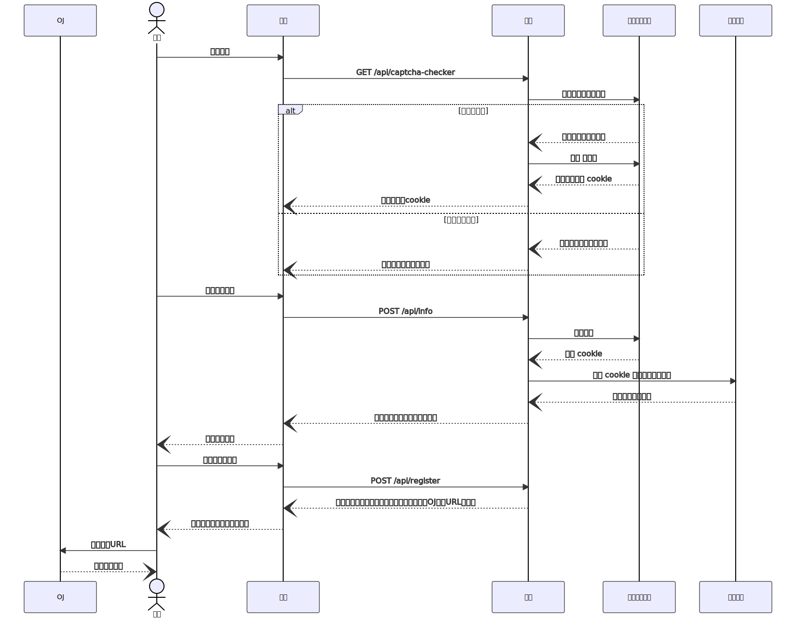

# 自助注册服务的设计与实现

## 1 项目背景和意义

OJ 账号体系与学校统一身份认证相互独立，互不依赖。

OJ 个人账号和竞赛账号需要对应真实学生身份，其他账号由管理员分配。

新生注册账号有两种方法：

+ 教师或管理员批量导入
+ 新生提前自助注册

自行注册的实现有三种方案：

+ OJ 对接统一身份认证
+ OJ 自行模拟登录
+ 第三方服务模拟登录并转发给 OJ

本项目是第三种方案的实现。

## 2 需求分析

在网页上完成自助注册流程，要求适度的校验，保证能够正确对应账号和身份信息。

## 3 相关技术介绍

### React

前端用户界面库/框架。

<https://reactjs.org/>

<https://react.docschina.org/>

### Next.js

前端框架，支持 SSR 和 API 路由。

<https://nextjs.org/>

<https://www.nextjs.cn/>

### antd

前端 UI 组件库

<https://ant.design/index-cn>

### 爬虫

一类自动获取、清洗、保存网页中有用数据的技术。

### TypeORM

TypeScript ORM，用于操作数据库。

<https://typeorm.io/>

### SQLite

嵌入式 SQL 数据库。

<https://sqlite.org/index.html>

# 4 项目设计

## 4.1 注册流程



## 4.2 数据库表结构

```typescript
@Entity()
export class StudentInfo {
    @PrimaryColumn({ type: "varchar", length: 32 })
    id!: string; // 学号

    @Column({ type: "varchar", length: 32 })
    name!: string; // 姓名

    @Column({ type: "varchar", length: 32 })
    gender!: string; // 性别

    @Column({ type: "varchar", length: 256 })
    major!: string; // 专业

    @Column({ type: "varchar", length: 256 })
    college!: string; // 学院

    @Column({ type: "varchar", length: 256 })
    class!: string; // 班级

    @Column({ type: "varchar", length: 32 })
    grade!: string; // 年级

    @Column({ type: "varchar", length: 512 })
    nickname!: string; // 昵称

    @UpdateDateColumn()
    updatedTime!: Date; // 更新时间
}
```

## 4.3 安全机制

部署者在配置文件中写入 OJ 注册接口的**密钥**。

后端根据**账号数据**和**接口密钥**生成**签名**，使用 SHA-256 哈希算法。

OJ 注册接口接受**账号数据**和**签名**，根据**密钥**重新计算**正确签名**。

如果**传入的签名**与**正确签名**匹配，说明此次注册来源于已授权的服务，可以接受。

如果不匹配，则拒绝注册。

